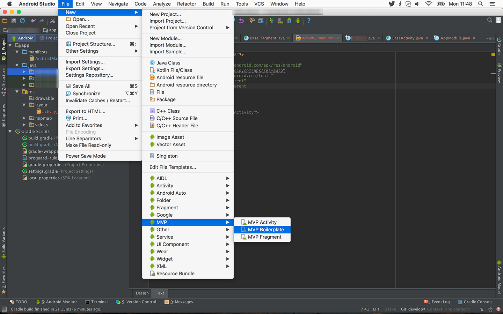

# Android Studio MVP Template

This is an Android Studio template for MVP. 

It is inspired by [u2020-mvp-android-studio-template](https://github.com/LiveTyping/u2020-mvp-android-studio-template) and follows [Antonio Leiva's MVP implementation guide for Android](http://antonioleiva.com/mvp-android/). It also implements presenter surviving orientation changes following [Antonio Gutierrez's article](https://medium.com/@czyrux/presenter-surviving-orientation-changes-with-loaders-6da6d86ffbbf).

> If you are looking for the first version, without presenter survival, please download the [first release](https://github.com/benoitletondor/Android-Studio-MVP-template/tree/1.0). Note that version 2 (current one) is not compatible with version 1.

Here's the hierarchy it follows:

```
com.company.app
    +-- injection
    |   - ActivityScope
    |   - AppComponent
    |   - AppModule
    |   - FragmentScope
    |   - MainViewComponent
    |   - MainViewModule
    +-- interactor
    |   +-- impl
    |       - MainViewInteractorImpl
    |   - BaseInteractor
    |   - MainViewInteractor
    +-- presenter
    |   +-- impl
    |       - BasePresenterImpl
    |       - MainViewPresenterImpl
    |   - BasePresenter
    |   - MainViewPresenter
    +-- view
    |   +-- impl
    |       - BaseActivity
    |       - BaseFragment
    |       - MainActivity
    |   - MainView
    | - YourApp
```

## Prerequisites

You must use [Dagger 2](http://google.github.io/dagger/) for dependency injection and `AppCompat` for annotations and base classes.

## Installation

#### For Mac:

- If you have a standard Android Studio installation:

Just run the install script at the root of this repository:

```
./install.sh
```

- Manual installation:

Just copy all 3 directories `MVPFragment`, `MVPActivity` and `MVPBoilerplate` to `$ANDROID_STUDIO_FOLDER$/Contents/plugins/android/lib/templates/activities/`

#### For Windows:

Just copy all 3 directories `MVPFragment`, `MVPActivity` and `MVPBoilerplate` to `$ANDROID_STUDIO_FOLDER$\plugins\android\lib\templates\activities\`

## How to use

#### 1. Generate base boilerplate

First of all, create the base hierarchy and classes using `MVP Boilerplate` from the **root package folder**. This needs to be done only once per project:



It will generate an `App` class that you should use as your Application, an `ActivityScope`, `FragmentScope`, `AppModule` and `AppComponent` for injection, a `BaseActivity`, `BaseFragment`, `BasePresenter`, `BasePresenterImpl` and `BaseInteractor`. It also generates the common classes for presenter persistancy (`PresenterFactory` and `PresenterLoader`).

> Be sure to use the generated `App` as your Application into your manifest!

#### 2. Create your first activity

Then you can create a new `MVP Activity`. It will create:

- An `Activity`
- A layout for your Activity
- A `Component` and a `Module` for Dagger 2 injection
- A `View` interface for your Activity
- A `Presenter` interface and default implementation class
- An `Interactor` interface and default implementation class for your model

> It's important that you **create it from the root package**, otherwise it will re-create the whole MVP hierarchy under your subpackage which is not what you want.

## Presenter lifecycle (Important!)

Your presenter will be kept across activity re-creation on orientation changes using a [Loader](https://developer.android.com/guide/components/loaders.html). For more details about how its done, read [Antonio Gutierrez's article](https://medium.com/@czyrux/presenter-surviving-orientation-changes-with-loaders-6da6d86ffbbf).

It means that:

- You want to be sure to update your view state on each `onStart` call of your presenter since your view may have been destroyed and re-created since last `stop`.
- You should use the `viewCreated` parameter of the `onStart` method to know if the view has been created or re-created (e.g. following a screen rotation). This boolean will be true only if the view has just been created so **if it's `true` you should update your view according to the presenter's state**.
- You should *not* stop your background operations on the `onStop` method (things like HTTP calls or database connection) since your view may still be available (on the next `onStart` call).
- You **must** stop all background operation on the `onPresenterDestroyed` method. When this method is reached, it means that your view is completely destroyed and will not be re-created later.

You should also be **very** careful about:

- Since the presenter is loaded asynchronously by a `Loader`, it means that it's not available before the view actually started. So **the `mPresenter` variable can (and will probably) be null when your activity or fragment starts** (you should **not** call your presenter directly into `onCreate`, `onStart` or `onResume` methods).
- To avoid leaks, your presenter will not keep a reference on your view when this view is stopped. It means that **your view is guaranteed to be available from the `onStart` method to the `onStop`**. It also means it will be `null` outside of this scope.

> To ensure those last 2 points, `mView` and `mPresenter` are annotated with `@Nullable`, to enforce the check by the linter. It's a good idea to surround all calls with `!=null`.

## Contributors

- [Martyn Haigh](https://github.com/martynhaigh): MacOS installation script
- [Boris Strandjev](https://github.com/bstrandjev): Minor tweaks and enhancements
- [Brian Hoang](https://github.com/namhvcntt): AndroidX migration

## License

    Copyright 2019 Benoit LETONDOR

    Licensed under the Apache License, Version 2.0 (the "License");
    you may not use this file except in compliance with the License.
    You may obtain a copy of the License at

       http://www.apache.org/licenses/LICENSE-2.0

    Unless required by applicable law or agreed to in writing, software
    distributed under the License is distributed on an "AS IS" BASIS,
    WITHOUT WARRANTIES OR CONDITIONS OF ANY KIND, either express or implied.
    See the License for the specific language governing permissions and
    limitations under the License.
