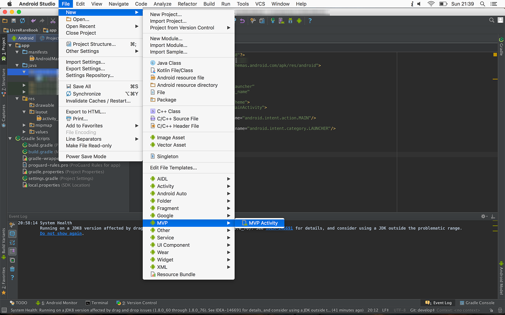

# Android Studio Template MVP Template

This is an Android Studio template for MVC. 

It is inspired by [u2020-mvp-android-studio-template](https://github.com/LiveTyping/u2020-mvp-android-studio-template) but works in a different way (Removes the scene part and add the interactor object).

It follows [Antonio Leiva's MVC implementation guide for Android](http://antonioleiva.com/mvp-android/) and will generate:

- An Activity
- A layout for your Activity
- A `Scope`, a `Component` and a `Module` for Dagger 2 injection
- A `View` interface for your Activity
- A `Presenter` interface and default implementation class
- An `Interactor` interface and default implementation class for your model

Disclaimer: This is a work in progress made for my own needs.

## Prerequisites

You must use [Dagger 2](http://google.github.io/dagger/) for dependency injection and `AppCompat` for annotations and base classes.

## Installation

### For Mac:

Just copy all files to `$ANDROID_STUDIO_FOLDER$/Contents/plugins/android/lib/templates/activities/MVP`

### For Windows:

Just copy all files to `$ANDROID_STUDIO_FOLDER$\plugins\android\lib\templates\activities\MVP`

## How to use

## TODO

- Provide `BaseActivity`, `BasePresenter` and `BaseInteractor` implementations
- Manage Fragment
- Add a hierarchy management

## License

    Copyright 2016 Benoit LETONDOR

    Licensed under the Apache License, Version 2.0 (the "License");
    you may not use this file except in compliance with the License.
    You may obtain a copy of the License at

       http://www.apache.org/licenses/LICENSE-2.0

    Unless required by applicable law or agreed to in writing, software
    distributed under the License is distributed on an "AS IS" BASIS,
    WITHOUT WARRANTIES OR CONDITIONS OF ANY KIND, either express or implied.
    See the License for the specific language governing permissions and
    limitations under the License.